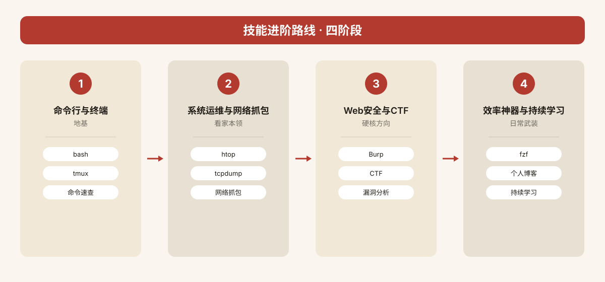

  

<h1 align="center">secret-knowledge-zh</h1>

> **24.7 万 star 的「程序员秘密武器库」，终于有中文速查版了。**
>
> 从 GitHub 顶流仓库 [trimstray/the-book-of-secret-knowledge](https://github.com/trimstray/the-book-of-secret-knowledge)（MIT，24.7 万 star）的 900+ 条技能清单里，精选 **240 个中文开发者真正用得上的技能**：命令行、抓包、安全、隐私、CTF、终端美化、效率神器……每条配一句中文说明 + 难度星级，打开就能用。

---

⭐ 如果对你有帮助，点个 Star 支持中文开源

## ✨ 为什么值得收藏

- **240 个技能 / 12 个分类**：从原仓库 900+ 条中筛掉小众与失效，留下都是常用硬货；
- **一句话讲明白**：每条说明「这工具是干嘛的、什么场景用」，不再对着英文工具名发懵；
- **难度星级**：★ 入门到 ★★★★★ 专家，按需挑选不踩坑；
- **链接真实可核验**：全部原样取自原仓库清单，零占位符、零编造；
- **新手友好**：文末有「新手先从这 15 个开始」速览，按图索骥直接上手。

---

## 🗂 分类总览

| # | 分类 | 条数 | # | 分类 | 条数 |
| --- | --- | --- | --- | --- | --- |
| 1. 命令行与终端 | 24 | 7. 编辑器与终端美化 | 14 |
| 2. 系统与运维 | 24 | 8. 数据与文本处理 | 18 |
| 3. 网络基础与抓包 | 20 | 9. 效率神器 | 20 |
| 4. Web与安全 | 20 | 10. 开发与版本控制 | 16 |
| 5. 隐私与匿名 | 16 | 11. 学习与资源 | 26 |
| 6. 逆向与CTF | 18 | 12. 硬核进阶精选 | 24 |

| **合计** | **12 个分类** | **240 个技能** |  |  |  |

  

---

## 🚀 新手先从这 15 个开始

以下 15 个工具/技能覆盖面最广、上手最快，建议先点进链接玩一圈：

| # | 工具/技能 | 分类 | 一句话 |
| --- | --- | --- | --- |
| 1 | GNU Bash | 命令行与终端 | 所有终端操作的地基，先会它 |
| 2 | Zsh + Oh My ZSH! | 命令行与终端 | 让终端好看好用，配一次爽十年 |
| 3 | tmux | 命令行与终端 | 终端分屏 + 会话保持，远程开发必备 |
| 4 | fzf | 命令行与终端 | 模糊搜索神器，文件/历史命令秒找 |
| 5 | curl | 网络基础与抓包 | 测接口、下文件全靠它 |
| 6 | tcpdump | 网络基础与抓包 | 命令行抓包第一课 |
| 7 | nmap | 网络基础与抓包 | 端口扫描标准答案 |
| 8 | openssl | 网络基础与抓包 | 证书、加密、签名都找它 |
| 9 | htop | 系统与运维 | 比 top 好十倍的资源监视器 |
| 10 | strace | 系统与运维 | 看进程系统调用，排查疑难杂症 |
| 11 | lsof | 系统与运维 | 谁占着端口/文件，一问便知 |
| 12 | jq | 数据与文本处理 | 命令行处理 JSON 的瑞士军刀 |
| 13 | Visual Studio Code | 编辑器与终端美化 | 现代编辑器第一选择 |
| 14 | Regex101 | 效率神器 | 在线写正则，实时看匹配 |
| 15 | explain shell | 学习与资源 | 看不懂的命令，粘贴进去就解释 |

> 全表以 `categories/` 内实际条目为准，链接见对应分类文件。

  

---

## 📖 字段说明

- **工具/技巧**：保留英文原名（工具名不翻译），部分附中文注释；
- **一句话说明**：原创中文重述，说明用途与场景；
- **难度**：★ 入门 / ★★ 易上手 / ★★★ 需学习 / ★★★★ 进阶 / ★★★★★ 专家向；
- **链接**：原样取自原仓库清单，个别年久失效欢迎提 Issue。

---

# 分类正文

## 1. 命令行与终端（24 个）
> 掌握 Shell 与终端工具，让命令行效率倍增。

| 工具/技巧 | 一句话说明 | 难度 | 链接 |
| --- | --- | --- | --- |
| GNU Bash | Linux/macOS 默认 Shell，脚本与交互式命令的事实标准 | ★★ | https://www.gnu.org/software/bash/ |
| Zsh | 功能更全的扩展型 Shell，补全与定制能力强，常配插件使用 | ★★ | https://www.zsh.org/ |
| Oh My ZSH! | Zsh 配置管理框架，插件与主题海量，开箱即用 | ★ | https://ohmyz.sh/ |
| Starship | 跨 Shell 的极简提示符，一行配置同时美化 Bash/Zsh/Fish | ★ | https://github.com/starship/starship |
| fzf | 通用命令行模糊查找器，可补全历史命令、文件与进程 | ★★ | https://github.com/junegunn/fzf |
| z | 按访问频率智能跳转目录，省去层层 cd 敲完整路径 | ★ | https://github.com/rupa/z |
| zsh-autosuggestions | 按历史记录灰色自动补全命令，右方向键即可接受 | ★ | https://github.com/zsh-users/zsh-autosuggestions |
| zsh-syntax-highlighting | 命令行实时语法高亮，写错命令立即变红提示 | ★ | https://github.com/zsh-users/zsh-syntax-highlighting |
| tmux（终端复用器） | 单窗口分屏多任务，保持会话断连后任务不中断 | ★★★ | https://github.com/tmux/tmux/wiki |
| screen | 老牌终端会话管理器，远程断线后任务仍在后台运行 | ★★★ | https://www.gnu.org/software/screen/ |
| Kitty | GPU 加速的终端模拟器，支持图片渲染与远程图形 | ★★ | https://sw.kovidgoyal.net/kitty/ |
| Alacritty | Rust 加 OpenGL 打造的极速跨平台终端模拟器 | ★★ | https://github.com/alacritty/alacritty |
| ranger | Vim 键位风格的终端文件管理器，鼠标键盘皆可操作 | ★★★ | https://github.com/ranger/ranger |
| PuTTY | Windows 下最经典的 SSH/Telnet 客户端，轻量免费 | ★ | https://www.putty.org/ |
| Mosh | 弱网漫游不掉线的远程终端，网络抖动也能自动恢复会话 | ★★ | https://mosh.org/ |
| nmap | 知名网络扫描与资产发现工具，探测主机端口与服务 | ★★★ | https://nmap.org/ |
| netcat | 网络瑞士军刀，读写 TCP/UDP 连接，可探测端口与传文件 | ★★★ | http://netcat.sourceforge.net/ |
| socat | 双向数据中继，在任意两类地址间转发流量做调试 | ★★★★ | http://www.dest-unreach.org/socat/ |
| tcpdump | 老牌命令行抓包工具，实时分析网络报文定位问题 | ★★★★ | https://www.tcpdump.org/ |
| mtr | 融合 ping 与 traceroute，实时显示每跳丢包与延迟 | ★★ | https://github.com/traviscross/mtr |
| curl | 全能 URL 传输命令行工具，调试接口与下载文件必备 | ★★ | https://curl.haxx.se/ |
| HTTPie | 语法友好的现代 HTTP 客户端，调试 API 比 curl 更直观 | ★ | https://github.com/jakubroztocil/httpie |
| openssl | TLS/SSL 全套工具库，可生成证书、加解密与探测服务 | ★★★★ | https://www.openssl.org/ |
| Certbot | EFF 官方工具，一键申请并自动续期 Let's Encrypt 证书 | ★★ | https://github.com/certbot/certbot |

## 2. 系统与运维（24 个）
> 进程监控、容器编排与服务搭建，运维人案头利器。

| 工具/技巧 | 一句话说明 | 难度 | 链接 |
| --- | --- | --- | --- |
| htop | 交互式进程查看器，比 top 更直观的彩色资源监控面板 | ★★ | https://github.com/hishamhm/htop |
| glances | Python 写的跨平台监控面板，一眼看尽 CPU/内存/磁盘/网络 | ★★ | https://nicolargo.github.io/glances/ |
| strace | 跟踪进程系统调用，定位程序卡住或权限问题的利器 | ★★★★ | https://github.com/strace/strace |
| sysdig | 系统级排障工具，捕获并过滤全量系统事件，原生兼容容器 | ★★★ | https://github.com/draios/sysdig |
| lsof | 列出进程打开的文件与网络连接，排查端口占用常用 | ★★★ | https://en.wikipedia.org/wiki/Lsof |
| bpftrace | 基于 eBPF 的高级追踪语言，做性能剖析与疑难定位 | ★★★★★ | https://github.com/iovisor/bpftrace |
| lnav | 日志文件导航器，自动解析格式并支持搜索与高亮 | ★★ | https://lnav.org |
| GoAccess | 实时 Web 日志分析器，在终端里直接输出可视化报表 | ★★ | https://goaccess.io/ |
| mycli | 带自动补全和语法高亮的 MySQL 命令行客户端 | ★★ | https://github.com/dbcli/mycli |
| pgcli | 为 PostgreSQL 量身定制的智能命令行客户端 | ★★ | https://github.com/dbcli/pgcli |
| iredis | 交互式 Redis 终端，自动补全命令并高亮返回结果 | ★★ | https://github.com/laixintao/iredis |
| Moby | Docker 背后的开源容器引擎项目，容器化技术的基石 | ★★★ | https://github.com/moby/moby |
| ctop | 容器版 top，实时查看各 Docker 容器的资源占用情况 | ★★ | https://github.com/bcicen/ctop |
| Traefik | 自动发现后端的反向代理，与 Docker 及 HTTPS 无缝集成 | ★★★ | https://traefik.io/ |
| portainer | 图形化 Docker 管理面板，在网页上即可管理容器与镜像 | ★★ | https://github.com/portainer/portainer |
| trivy | 容器与文件系统漏洞扫描器，适合接入 CI 流水线自动检查 | ★★★ | https://github.com/aquasecurity/trivy |
| Harbor | 云原生私有镜像仓库，支持镜像签名、漏洞扫描与权限 | ★★★ | https://goharbor.io/ |
| Nginx | 高性能 Web 与反向代理服务器，互联网部署的事实标准 | ★★★ | https://nginx.org/ |
| Caddy Server | 默认自动 HTTPS 的极简 Web 服务器，几行配置即可上线 | ★★ | https://caddyserver.com/ |
| HAProxy | 高性能 TCP/HTTP 负载均衡器，大流量场景扛压首选 | ★★★ | https://www.haproxy.org/ |
| Varnish Cache | 面向动态站点的 HTTP 加速器，缓存命中后响应极快 | ★★★ | https://varnish-cache.org/ |
| pi-hole | 全网级 DNS 广告过滤，路由器部署后全家设备免广告 | ★★ | https://github.com/pi-hole/pi-hole |
| docker_practice | yeasy 出品的中文 Docker 实战教程，入门 DevOps 必读 | ★ | https://github.com/yeasy/docker_practice |
| kubernetes-the-hard-way | 手写一步步从零搭建 K8s，彻底理解集群内部原理 | ★★★★ | https://github.com/kelseyhightower/kubernetes-the-hard-way |

## 3. 网络基础与抓包（20 个）
> 从抓包、扫描到测速与 TLS 诊断，网络排障随身工具集。

| 工具/技巧 | 一句话说明 | 难度 | 链接 |
| --- | --- | --- | --- |
| **tcpdump**（命令行抓包） | 经典 Linux 抓包工具，按协议/端口过滤报文并保存为 pcap | ★★★ | https://www.tcpdump.org/ |
| **tshark**（Wireshark CLI） | Wireshark 的命令行版本，支持上千种协议解析 | ★★★★ | https://www.wireshark.org/docs/man-pages/tshark.html |
| **Termshark**（终端抓包 TUI） | 在终端里以交互界面查看和解码实时网络流量 | ★★ | https://termshark.io/ |
| **nmap**（端口扫描器） | 主机发现、端口探测与服务指纹识别的事实标准 | ★★★ | https://nmap.org/ |
| **netcat**（网络瑞士军刀） | 任意 TCP/UDP 读写与端口探测，常用于反弹 Shell | ★★ | http://netcat.sourceforge.net/ |
| **socat**（多用途中继） | netcat 的增强版，支持端口转发与加密通道 | ★★★ | http://www.dest-unreach.org/socat/ |
| **hping**（自定义数据包） | 手工构造 TCP/IP 数据包，用于防火墙测试与压测 | ★★★★ | http://www.hping.org/ |
| **ngrep**（抓包版 grep） | 按正则表达式在流量中匹配载荷内容，快速定位请求 | ★★★ | https://github.com/jpr5/ngrep |
| **mtr**（路由追踪） | 结合 ping 与 traceroute，实时显示每跳丢包与延迟 | ★ | https://github.com/traviscross/mtr |
| **iPerf3**（带宽测速） | 测量 TCP/UDP 最大吞吐量，定位网络带宽瓶颈 | ★★ | https://iperf.fr/ |
| **Scapy**（数据包构造库） | 用 Python 构造、解析和注入任意网络报文 | ★★★★★ | https://scapy.net/ |
| **openssl**（TLS 工具箱） | 生成证书、测试 HTTPS 连接与查看证书链 | ★★★ | https://www.openssl.org/ |
| **gnutls-cli**（TLS 诊断） | 命令行发起 TLS 握手并输出证书与协商细节 | ★★★ | https://gnutls.org/manual/html_node/gnutls_002dcli-Invocation.html |
| **testssl.sh**（TLS 扫描） | 一键检测目标站点的加密协议、套件与已知漏洞 | ★★ | https://github.com/drwetter/testssl.sh |
| **curl**（HTTP 请求） | 命令行数据传输神器，支持多种协议与断点续传 | ★ | https://curl.haxx.se/ |
| **HTTPie**（易用 HTTP 客户端） | 语法接近浏览器的命令行 HTTP 工具，输出带高亮 | ★ | https://github.com/jakubroztocil/httpie |
| **httpstat**（请求耗时可视化） | 以瀑布图展示 DNS、连接、TLS 到首字节各阶段耗时 | ★★ | https://github.com/reorx/httpstat |
| **DNSdumpster**（在线 DNS 枚举） | 浏览器内快速枚举目标域名的子域与 DNS 记录 | ★ | https://dnsdumpster.com/ |
| **ViewDNS**（在线 DNS 反查） | 提供反向 IP、历史 DNS、传递域等在线查询 | ★ | http://viewdns.info/ |
| **BGPview**（BGP 路由查询） | 在线查看 AS 与 IP 段的 BGP 路由和归属信息 | ★★ | https://bgpview.io/ |

## 4. Web 与安全（20 个）
> 站点 Headers、TLS 配置、空间搜索引擎与漏洞库一站式速查。

| 工具/技巧 | 一句话说明 | 难度 | 链接 |
| --- | --- | --- | --- |
| **Security Headers**（安全头检测） | 在线评估站点 HTTP 安全响应头并给出改进建议 | ★ | https://securityheaders.com/ |
| **Observatory by Mozilla**（Mozilla 扫描） | Mozilla 出品的站点安全综合评分与配置报告 | ★ | https://observatory.mozilla.org/ |
| **SSL Labs Server Test**（SSL 评级） | 对目标 HTTPS 站点做深度 TLS 配置评级 | ★ | https://www.ssllabs.com/ssltest/ |
| **crt.sh**（证书透明度查询） | 通过证书透明度日志反查域名的历史证书 | ★ | https://crt.sh/ |
| **CSP Evaluator**（CSP 策略评估） | Google 出品的内容安全策略 CSP 安全审计工具 | ★★ | https://csp-evaluator.withgoogle.com/ |
| **badssl.com**（TLS 错误训练场） | 提供各种 TLS 错误配置示例用于测试客户端 | ★ | https://badssl.com/ |
| **security.txt**（安全联系规范） | 站点用于对外公布安全漏洞联系渠道的标准 | ★★ | https://securitytxt.org/ |
| **urlscan.io**（网站沙箱扫描） | 在隔离环境中加载站点并截图、记录请求链 | ★★ | https://urlscan.io/ |
| **Shodan**（物联网空间搜索） | 全网设备搜索引擎，按端口/指纹检索暴露服务 | ★★ | https://www.shodan.io/ |
| **Censys**（攻击面搜索） | 扫描全网主机与证书，用于资产与攻击面梳理 | ★★ | https://censys.io/ |
| **FOFA**（网络空间测绘） | 中文网络空间搜索引擎，按图标/指纹定位资产 | ★★ | https://fofa.so/ |
| **ZoomEye**（空间搜索引擎） | 知道创宇出品的全网设备与网站指纹检索 | ★★ | https://www.zoomeye.org/ |
| **GreyNoise**（噪音流量情报） | 区分互联网扫描噪音与真实攻击的威胁情报 | ★★ | https://viz.greynoise.io/table |
| **builtwith**（技术栈识别） | 在线识别站点使用的框架、CDN 与分析服务 | ★ | https://builtwith.com/ |
| **CVE Mitre**（CVE 官方库） | CVE 编号的官方发布与权威漏洞定义库 | ★ | https://cve.mitre.org/ |
| **CVE Details**（CVE 详情检索） | 按厂商、产品、评分检索 CVE 漏洞与统计 | ★ | https://www.cvedetails.com/ |
| **Exploit DB**（漏洞利用库） | Offensive Security 维护的公开漏洞利用代码库 | ★★ | https://www.exploit-db.com/ |
| **Lynis**（系统安全审计） | Linux/Unix 主机安全加固与合规扫描工具 | ★★ | https://cisofy.com/lynis/ |
| **LinEnum**（Linux 枚举脚本） | 一键枚举 Linux 主机本地提权线索的 Shell 脚本 | ★★ | https://github.com/rebootuser/LinEnum |
| **Fake Name Generator**（假身份生成） | 生成随机姓名、地址与身份信息用于测试 | ★ | https://www.fakenamegenerator.com/ |

## 5. 隐私与匿名（16 个）

> 从搜索、邮箱到通讯，一套保护日常数字身份的工具链。

| 工具/技巧 | 一句话说明 | 难度 | 链接 |
| --- | --- | --- | --- |
| DuckDuckGo（隐私搜索引擎） | 不追踪搜索记录的匿名搜索引擎，可作百度/谷歌的日常替代 | ★ | https://duckduckgo.com/ |
| Startpage（匿名搜索） | 后端调取 Google 结果却隐藏你的身份，不留日志 | ★ | https://www.startpage.com/ |
| searX（自建元搜索） | 开源可自托管的元搜索引擎，聚合多源结果且不跟踪 | ★★ | https://searx.me/ |
| ProtonMail（加密邮箱） | 瑞士研发的端到端加密邮箱，适合收发敏感邮件 | ★ | https://protonmail.com/ |
| Tutanota（加密邮箱） | 德国出品的安全邮箱，正文与附件默认端到端加密 | ★ | https://tutanota.com/ |
| KeePassXC（本地密码库） | 跨平台本地密码管理器，自动填充且数据不上云 | ★★ | https://keepassxc.org/ |
| Bitwarden（密码同步） | 开源跨设备同步的密码管理器，免费版已足够日常 | ★ | https://bitwarden.com/ |
| Signal（加密通讯） | 端到端加密即时通讯，文字、语音、视频全程加密 | ★ | https://www.signal.org/ |
| Matrix（去中心化通讯） | 开源联邦式实时通信协议，可自建服务器掌控数据 | ★★ | https://matrix.org/ |
| Wire（安全协作） | 兼顾聊天、文件与视频会议的安全通讯工具 | ★ | https://wire.com/en/ |
| Keybase（公钥身份） | 基于公钥加密的身份校验与加密文件分享工具 | ★★ | https://keybase.io/ |
| SKS OpenPGP Keyserver（PGP 公钥服务器） | Ubuntu 维护的 OpenPGP 公钥目录，用于收发与校验公钥 | ★★ | https://keyserver.ubuntu.com/ |
| Privacy Guides（隐私指南） | 整理反监控与隐私工具选型的中文/英文权威入门指南 | ★ | https://www.privacyguides.org/ |
| Mail2Tor（Tor 匿名邮箱） | 跑在 Tor 隐服务上的匿名邮箱，收发全程走暗网 | ★★ | http://mail2tor.com/ |
| Nipe（Tor 全局出口） | 一条脚本把本机默认网关切到 Tor 网络，实现全局匿名 | ★★★ | https://github.com/GouveaHeitor/nipe |
| multitor（多 Tor 实例） | 同时拉起多个 Tor 实例并做负载均衡，便于批量切换出口 | ★★★ | https://github.com/trimstray/multitor |

## 6. 逆向与 CTF（18 个）

> 从漏洞库到靶场，按图索骥练出实战攻防手感。

| 工具/技巧 | 一句话说明 | 难度 | 链接 |
| --- | --- | --- | --- |
| CVE Mitre（漏洞编号库） | 官方 CVE 漏洞编号总目录，查任何漏洞先从这里入手 | ★ | https://cve.mitre.org/ |
| CVE Details（漏洞详情） | 按厂商、产品、版本筛选 CVE，并看 CVSS 评分与利用情况 | ★ | https://www.cvedetails.com/ |
| Exploit DB（公开利用库） | Rapid7 维护的公开 exploit 归档，按 CVE 与平台检索 | ★★ | https://www.exploit-db.com/ |
| Vulncode-DB（漏洞源码库） | 收录漏洞及其对应源码片段，适合做代码审计学习 | ★★ | https://www.vulncode-db.com/ |
| sploitus（exploit 聚合搜索） | 一站式聚合搜索公开 exploit 与渗透测试工具 | ★ | https://sploitus.com/ |
| Hack The Box（在线靶机） | 知名在线靶机平台，从易到难练真实主机渗透 | ★★★ | https://www.hackthebox.eu/ |
| TryHackMe（引导式靶场） | 面向新手的引导式学习房间，边做边学渗透基础 | ★★ | https://tryhackme.com/ |
| CTFtime（赛事日历） | 全球 CTF 赛事日历、题目与战队排名的权威榜单 | ★ | https://ctftime.org/ |
| picoCTF（入门 CTF） | 卡内基梅隆大学出品的入门级 CTF 刷题平台 | ★★ | https://picoctf.com/ |
| OverTheWire（wargame） | 经典 wargame，从 Linux 基础到二进制逐步闯关 | ★★ | http://overthewire.org/wargames/ |
| Vulnhub（本地靶机镜像） | 下载易受攻击的虚拟机镜像，本地搭靶场练手 | ★★★ | https://www.vulnhub.com/ |
| pwnable.kr（pwn 刷题） | 二进制 pwn 方向的经典刷题站，适合栈/堆溢出入门 | ★★★★ | http://pwnable.kr/index.php |
| Root Me（多方向挑战） | 涵盖 Web、逆向、密码学、取证的多方向在线挑战 | ★★ | https://www.root-me.org/?lang=en |
| Hacker101（H1 免费课程） | HackerOne 出品的免费 Web 安全课程与配套靶场 | ★★ | https://www.hacker101.com/ |
| DVWA（脆弱 Web 应用） | 本地搭建的演示型漏洞 Web，用于练习 OWASP Top 10 | ★★ | http://www.dvwa.co.uk/ |
| OWASP Juice Shop（现代靶场） | 基于现代 JS 栈的 OWASP 靶场，覆盖最新 Web 漏洞 | ★★ | https://www.owasp.org/index.php/OWASP_Juice_Shop_Project |
| vulhub（Docker 漏洞环境） | 用 Docker 一键拉起各类 CVE 漏洞复现环境 | ★★ | https://github.com/vulhub/vulhub |
| PHP-backdoors（PHP 后门样本） | 收集各类 PHP 后门样本，仅供安全研究与教学使用 | ★★★ | https://github.com/bartblaze/PHP-backdoors |

## 7. 编辑器与终端美化（14 个）
> 选对编辑器与终端，编码效率立刻翻倍。

| 工具/技巧 | 一句话说明 | 难度 | 链接 |
| --- | --- | --- | --- |
| vim（模态文本编辑器） | 经典模态编辑器，键盘不离手即可完成所有编辑操作 | ★★★ | https://www.vim.org/ |
| neovim（现代 vim） | vim 的现代重构版，插件生态活跃，开箱配置更顺手 | ★★★ | https://neovim.io/ |
| emacs（可扩展编辑器） | 可扩展到极限的编辑器，配置成几乎能当系统用 | ★★★★★ | https://www.gnu.org/software/emacs/ |
| micro（终端编辑器） | 开箱即用的终端编辑器，方向键回车就能上手 | ★ | https://github.com/zyedidia/micro |
| spacemacs（emacs 发行版） | Emacs 社区发行版，把 vim 与 emacs 键位合二为一 | ★★★★ | https://www.spacemacs.org/ |
| Visual Studio Code | 微软免费开源编辑器，插件市场丰富，前端开发首选 | ★★ | https://code.visualstudio.com/ |
| Sublime Text | 轻量极速的跨平台编辑器，多光标编辑手感一流 | ★★ | https://www.sublimetext.com/3 |
| Kitty（GPU 终端） | GPU 加速的终端模拟器，支持图片与高清渲染 | ★★ | https://sw.kovidgoyal.net/kitty/ |
| Alacritty（OpenGL 终端） | Rust 编写的 OpenGL 终端，追求极致简洁与性能 | ★★ | https://github.com/alacritty/alacritty |
| Guake（下拉终端） | 下拉式终端，一键呼出隐藏，随叫随到不打断思路 | ★ | https://github.com/Guake/guake |
| fzf（模糊查找器） | 通用命令行模糊查找器，检索历史与文件飞快 | ★★ | https://github.com/junegunn/fzf |
| z（目录快速跳转） | 按访问频率智能跳转目录，少敲一堆 cd 长路径 | ★ | https://github.com/rupa/z |
| zsh-autosuggestions | fish 风格历史命令自动补全，灰色提示一键接受 | ★ | https://github.com/zsh-users/zsh-autosuggestions |
| zsh-syntax-highlighting | zsh 命令实时语法高亮，命令写错立刻见分晓 | ★ | https://github.com/zsh-users/zsh-syntax-highlighting |

## 8. 数据与文本处理（18 个）
> 命令行里处理文本与数据，小工具也有大威力。

| 工具/技巧 | 一句话说明 | 难度 | 链接 |
| --- | --- --- | --- | --- |
| fd（find 替代品） | find 的现代替代品，默认正则加彩色输出，搜索快得多 | ★ | https://github.com/sharkdp/fd |
| ncdu（磁盘占用分析） | 基于 ncurses 的磁盘占用分析器，交互式清理大文件 | ★★ | https://dev.yorhel.nl/ncdu |
| F'Awk Yeah!（sed/awk 进阶） | sed/awk 进阶实战长文，讲日志解析类文本处理技巧 | ★★★★ | https://posts.specterops.io/fawk-yeah-advanced-sed-and-awk-usage-parsing-for-pentesters-3-e5727e11a8ad?gi=c8f9506b26b6 |
| URL Encode/Decode | 在线 URL 编码解码，一键转换中文与特殊字符 | ★ | https://www.url-encode-decode.com/ |
| Uncoder（日志查询互译） | 把各安全设备的日志查询语言互译，跨平台检索不抓瞎 | ★★★ | https://uncoder.io/ |
| Regex101（正则调试器） | 在线正则调试器，实时高亮匹配并逐段解释语法 | ★★ | https://regex101.com/ |
| RegExr（正则学习台） | 可视化学习与搭建正则表达式，内置常用元字符库 | ★★ | https://regexr.com/ |
| RegEx Testing | 轻量在线正则测试页，粘贴文本即时验证匹配结果 | ★ | https://www.regextester.com/ |
| RegEx Pal | 极简正则测试小站，附带常用替换与示例工具 | ★ | https://www.regexpal.com/ |
| CyberChef（网络瑞士军刀） | 编码解码加解密压缩一站搞定，数据处理拖曳即成 | ★★ | https://gchq.github.io/CyberChef/ |
| thispersondoesnotexist | 一键生成 AI 伪造人脸图，做演示占位图不用愁 | ★ | https://thispersondoesnotexist.com/ |
| AI Generated Photos | 十万张 AI 生成人物照片，可按性别年龄等属性筛选 | ★ | https://generated.photos |
| fakenamegenerator | 随机生成整套虚拟身份，批量造测试数据一步到位 | ★ | https://www.fakenamegenerator.com/ |
| Intigriti Redirector | 开放重定向与 SSRF 攻击 payload 在线生成器 | ★★★ | https://tools.intigriti.io/redirector/ |
| explainshell（命令行解释） | 把 man 手册拆开来，逐段解释每条命令的每个参数 | ★ | https://explainshell.com/ |
| ShellCheck（shell 检查） | 静态扫描 shell 脚本，揪出常见 bug 与坑写法 | ★★ | https://www.shellcheck.net/ |
| pure-bash-bible | 用纯 bash 内建功能替代外部命令的文本处理宝典 | ★★★ | https://github.com/dylanaraps/pure-bash-bible |
| the-art-of-command-line | 一页纸玩转命令行，集合高频技巧与最佳实践 | ★★ | https://github.com/jlevy/the-art-of-command-line |

## 9. 效率神器（20 个）
> 随手点开就用，让日常开发少走弯路。

| 工具/技巧 | 一句话说明 | 难度 | 链接 |
| --- | --- --- | --- | --- |
| Feedly | 聚合 RSS 订阅，把技术博客与资讯汇成一份日报 | ★ | https://feedly.com/ |
| Inoreader | 支持关键词过滤的 RSS 阅读器，只看真正关心的内容 | ★ | https://www.inoreader.com/ |
| Changelog | 面向开发者的新闻社区与播客站点，追踪行业动态 | ★ | https://changelog.com/ |
| taskwarrior | 终端里的待办管理工具，用命令行安排每日任务 | ★★ | https://taskwarrior.org |
| Regex101 | 在线调试正则表达式，实时高亮匹配并逐段解释 | ★★ | https://regex101.com/ |
| explainshell | 把一长串 Linux 命令拆开，逐段解释每个参数 | ★ | https://explainshell.com/ |
| ShellCheck | 在线检查 Shell 脚本，揪出常见 bug 与坏写法 | ★★ | https://www.shellcheck.net/ |
| jsbin | 浏览器里即时编写 HTML/CSS/JS，边写边看效果 | ★ | https://jsbin.com/?html,output |
| CodeSandbox | 在线前端工程环境，秒开框架模板直接写代码 | ★★ | https://codesandbox.io/ |
| Repl.it | 浏览器里的即开 IDE，多语言在线运行与协作 | ★★ | https://www.repl.it/ |
| hadolint（Dockerfile Linter） | Dockerfile 在线检查，按最佳实践审核镜像脚本 | ★★ | https://github.com/hadolint/hadolint |
| PageSpeed Insights | 谷歌出品的网页测速工具，给出优化建议 | ★ | https://developers.google.com/speed/pagespeed/insights/ |
| GTmetrix | 分析网站加载速度，定位拖慢首屏的资源 | ★ | https://gtmetrix.com/ |
| Pingdom Tools | 从全球多个节点测试网站访问延迟与可用性 | ★ | https://tools.pingdom.com/ |
| Lighthouse | Chrome 团队的网页自动化审计，跑分性能与规范 | ★★ | https://github.com/GoogleChrome/lighthouse |
| web.dev | 谷歌出品的现代 Web 开发学习与最佳实践指南站 | ★ | https://web.dev/ |
| fakenamegenerator | 一键生成随机身份信息，填测试数据时救急用 | ★ | https://www.fakenamegenerator.com/ |
| ThisPersonDoesNotExist | AI 生成不存在的人脸，做占位头像与演示素材 | ★ | https://thispersondoesnotexist.com/ |
| DevDocs API | 聚合各大语言与框架文档，离线可查的 API 手册 | ★ | https://devdocs.io/ |
| Irssi | 终端运行的轻量 IRC 客户端，适合常驻技术频道 | ★★★ | https://irssi.org |

## 10. 开发与版本控制（16 个）
> 管好代码与环境，站在巨人的肩膀上写代码。

| 工具/技巧 | 一句话说明 | 难度 | 链接 |
| --- | --- --- | --- | --- |
| Tig | 终端里的 Git 图形界面，浏览提交历史与暂存改动 | ★★★ | https://jonas.github.io/tig/ |
| GRV | 基于终端的 Git 仓库浏览器，按键遍历分支与提交 | ★★★ | https://github.com/rgburke/grv |
| Commit messages guide | 教你写出清晰规范的提交说明，让变更记录可读 | ★ | https://github.com/RomuloOliveira/commit-messages-guide |
| Awesome Python | 精选 Python 框架、库与资源的必看清单 | ★ | https://awesome-python.com/ |
| python-cheatsheet | 一页纸速查 Python 语法与常用内置用法 | ★ | https://github.com/gto76/python-cheatsheet |
| pythoncheatsheet.org | 面向初中级开发者的 Python 入门速查参考站 | ★ | https://www.pythoncheatsheet.org/ |
| wtfpython | 收集 Python 里反直觉的代码片段，测你懂多少 | ★★ | https://github.com/satwikkansal/wtfpython |
| Python's Magic Methods | 深入讲透 Python 魔术方法，吃透面向对象细节 | ★★★ | https://rszalski.github.io/magicmethods/ |
| Austin | 不改代码即可采样的 CPython 性能剖析器 | ★★★★ | https://github.com/p403n1x87/austin |
| Web Developer Roadmap | 前端/后端方向学习路线图，指明下一步学什么 | ★ | https://github.com/kamranahmedse/developer-roadmap |
| Front-End-Checklist | 上线前逐项核对的前端检查清单，不漏细节 | ★ | https://github.com/thedaviddias/Front-End-Checklist |
| Front-End-Performance-Checklist | 聚焦性能的前端优化清单，让页面跑得更快 | ★★ | https://github.com/thedaviddias/Front-End-Performance-Checklist |
| js-dev-reads | 精选前端开发者必读的书单与文章合集 | ★ | https://github.com/twhite96/js-dev-reads |
| Oh My ZSH! | Zsh 配置管理框架，插件主题一键搞定终端环境 | ★★ | https://ohmyz.sh/ |
| fzf | 万能命令行模糊搜索器，快速找文件与历史命令 | ★★★ | https://github.com/junegunn/fzf |
| Starship | 跨 Shell 的高颜值提示符，实时显示 Git 状态 | ★★ | https://github.com/starship/starship |

## 11. 学习与资源（26 个）
> 精选手册、教程与清单，让自学路径清晰高效。

| 工具/技巧 | 一句话说明 | 难度 | 链接 |
| --- | --- --- | --- | --- |
| **the-art-of-command-line** | 一页纸精通命令行，浓缩 Bash 常用技巧，初中级开发者上手。 | ★★ | https://github.com/jlevy/the-art-of-command-line |
| **bash-handbook** | Bash 入门手册，系统讲解 shell 语法与脚本编写，零基础友好。 | ★ | https://github.com/denysdovhan/bash-handbook |
| **Vim Cheat Sheet** | 多语言 Vim 速查表，常用按键与命令一图速查，新手必备。 | ★ | https://vim.rtorr.com/ |
| **DevDocs API** | 聚合数百种语言与框架文档，快速可搜，开发者常备手册站。 | ★ | https://devdocs.io/ |
| **cheat.sh** | 命令行里的万能速查，直接查询任意工具用法与示例。 | ★★ | https://cheat.sh/ |
| **devhints.io** | Rico 出品的精美速查表合集，覆盖 Git、Docker 等常用技术。 | ★ | https://devhints.io/ |
| **System Design Primer** | 大规模系统设计从入门到进阶，架构与面试学习经典。 | ★★★★ | https://github.com/donnemartin/system-design-primer |
| **free-programming-books** | 免费编程书籍大合集，多语言多方向，自学党的宝库。 | ★ | https://github.com/EbookFoundation/free-programming-books |
| **what-happens-when** | 从输入网址到页面渲染全流程，讲透 Web 底层原理。 | ★★★ | https://github.com/alex/what-happens-when |
| **The Illustrated TLS Connection** | 逐字节图解 TLS 握手过程，加密协议可视化必看。 | ★★★ | https://tls.ulfheim.net/ |
| **OWASP** | Web 安全权威组织，汇集漏洞清单与测试指南，入门必读。 | ★★★ | https://www.owasp.org/index.php/Main_Page |
| **howhttps.works** | 用漫画讲清 HTTPS 原理，生动易懂，入门科普佳选。 | ★★ | https://howhttps.works/ |
| **howdns.works** | 彩色漫画图解 DNS 工作机制，轻松理解域名解析。 | ★★ | https://howdns.works/ |
| **Julia's Drawings** | Julia Evans 的系统与调试手绘小册子，图文并茂好读。 | ★★ | https://drawings.jvns.ca/ |
| **Web Developer Roadmap** | 开发者学习路线图，前端、后端与全栈路径一目了然。 | ★ | https://github.com/kamranahmedse/developer-roadmap |
| **Awesome Sysadmin** | 运维开源资源大全，工具与教程一站式收录。 | ★★ | https://github.com/kahun/awesome-sysadmin |
| **build-your-own-x** | 亲手造轮子合集，从零实现数据库、操作系统等练手项目。 | ★★★ | https://github.com/danistefanovic/build-your-own-x |
| **OSSU computer-science** | 免费自学计算机科学完整路径，对标名校 CS 课程体系。 | ★★★ | https://github.com/ossu/computer-science |
| **Awesome Selfhosted** | 可自托管的开源服务清单，搭建私人云服务必备。 | ★★ | https://github.com/Kickball/awesome-selfhosted |
| **wtfpython** | Python 冷知识与坑点合集，帮你写出更地道的 Python 代码。 | ★★ | https://github.com/satwikkansal/wtfpython |
| **Darknet Diaries** | 暗网真实故事播客，安全圈最受欢迎的叙事类节目。 | ★★ | https://darknetdiaries.com/ |
| **LiveOverflow** | 二进制与 Web 安全视频频道，硬核内容免费开放学习。 | ★★★★ | https://www.youtube.com/channel/UClcE-kVhqyiHCcjYwcpfj9w |
| **Schneier on Security** | 安全泰斗 Bruce Schneier 的博客，洞察行业趋势与密码学。 | ★★★ | https://www.schneier.com/ |
| **Brendan Gregg's Blog** | 性能大牛的博客，系统性能分析与观测技术必读。 | ★★★★ | http://www.brendangregg.com/ |
| **Mozilla DoH Cartoon** | 火狐出品漫画科普，轻松理解 DNS-over-HTTPS 原理。 | ★★ | https://hacks.mozilla.org/2018/05/a-cartoon-intro-to-dns-over-https/ |
| **OpenSSL Certificate Authority** | 手把手用 OpenSSL 搭建私有 CA，运维实用教程。 | ★★★ | https://jamielinux.com/docs/openssl-certificate-authority/ |

## 12. 硬核进阶精选（24 个）
> 渗透武器库与逆向神功，安全老手的看家法宝。

| 工具/技巧 | 一句话说明 | 难度 | 链接 |
| --- | --- --- | --- | --- |
| **Metasploit**（渗透攻击框架） | 业界最主流的渗透框架，集成海量 exploit 与 payload，红队日常标配。 | ★★★★★ | https://www.metasploit.com/ |
| **Burp Suite**（Web 抓包神器） | Web 渗透拦截代理，抓包改包、扫描与模糊测试的事实标准。 | ★★★★ | https://portswigger.net/burp |
| **sqlmap**（SQL 注入神器） | 自动化检测与利用 SQL 注入漏洞，一键脱库的瑞士军刀。 | ★★★★ | http://sqlmap.org/ |
| **John The Ripper**（老牌破解器） | 老牌快速口令破解工具，支持多种哈希格式与字典规则。 | ★★★★ | https://www.openwall.com/john/ |
| **hashcat**（GPU 哈希破解） | 世界最快的 GPU 加速密码恢复工具，跑 hash 首选。 | ★★★★ | https://hashcat.net/hashcat/ |
| **mimikatz**（Windows 凭证提取） | 从内存抓取 Windows 明文口令与票据，内网渗透必备神器。 | ★★★★★ | https://github.com/gentilkiwi/mimikatz |
| **pwntools**（Exploit 开发框架） | CTF 与漏洞利用开发的 Python 库，写 pwn 题事半功倍。 | ★★★★★ | https://github.com/Gallopsled/pwntools |
| **Ghidra**（NSA 逆向框架） | NSA 开源的软件逆向工程套件，免费替代 IDA 的反编译器。 | ★★★★★ | https://github.com/NationalSecurityAgency/ghidra |
| **radare2**（命令行逆向） | 纯命令行二进制逆向框架，汇编分析与调试全家桶。 | ★★★★★ | https://github.com/radare/radare2 |
| **IDA**（反汇编标杆） | 业界标杆的多架构反汇编器与调试器，恶意软件分析标配。 | ★★★★★ | https://www.hex-rays.com/products/ida/index.shtml |
| **BeEF**（浏览器利用框架） | Hook 住受害浏览器后进行会话控制与横向渗透。 | ★★★★ | https://github.com/beefproject/beef |
| **YARA**（恶意特征匹配） | 用规则描述恶意样本特征的“瑞士军刀”，威胁狩猎必备。 | ★★★★ | https://github.com/VirusTotal/yara |
| **exploitdb**（Exploit 仓库） | Offensive Security 维护的公开 exploit 可检索归档。 | ★★★ | https://github.com/offensive-security/exploitdb |
| **mitmproxy**（HTTPS 拦截代理） | 支持 TLS 的交互式抓包代理，移动端与 API 测试利器。 | ★★★ | https://mitmproxy.org/ |
| **PayloadsAllTheThings**（Payload 大全） | Web 安全与 CTF 常用 payload、WAF 绕过姿势合集。 | ★★★ | https://github.com/swisskyrepo/PayloadsAllTheThings |
| **GTFOBins**（Unix 提权宝典） | 可被滥用绕过本地权限的 Unix 二进制清单，提权必查。 | ★★★★ | https://gtfobins.github.io/ |
| **SecLists**（渗透字典合集） | 目录爆破、密码喷溅、子域名枚举的字典全家桶。 | ★★ | https://github.com/danielmiessler/SecLists |
| **HackerOne**（漏洞赏金平台） | 全球最大众测漏洞赏金社区，提交真实漏洞换取奖金。 | ★★ | https://www.hackerone.com/ |
| **Shodan**（全网设备搜索） | 互联网设备搜索引擎，按端口服务指纹测绘攻击面。 | ★★★ | https://www.shodan.io/ |
| **Censys**（全网资产测绘） | 设备与 TLS 证书全网扫描平台，资产发现与监控常用。 | ★★★ | https://censys.io/ |
| **Exploit DB**（Exploit 官方站） | 官方公开 exploit 归档库，与 CVE 编号一一对应。 | ★★ | https://www.exploit-db.com/ |
| **CVE Mitre**（漏洞编号权威库） | 全球公开漏洞编号与官方目录的权威源头。 | ★★ | https://cve.mitre.org/ |
| **LinEnum**（Linux 枚举脚本） | Linux 本地信息收集与提权检查的一键枚举脚本。 | ★★★ | https://github.com/rebootuser/LinEnum |
| **PEASS**（提权神器全家桶） | LinPEAS/WinPEAS 套件，自动化收集提权线索。 | ★★★★ | https://github.com/carlospolop/privilege-escalation-awesome-scripts-suite |

---

## 🔍 怎么用这份清单

1. **新手**：先玩「新手先从这 15 个开始」，再逛 01 命令行与终端、11 学习与资源；
2. **系统/运维向**：02 系统与运维、08 数据与文本处理；
3. **安全向**：03 网络基础与抓包、04 Web与安全、06 逆向与CTF、12 硬核进阶精选；
4. **日常效率**：07 编辑器与终端美化、09 效率神器、10 开发与版本控制；
5. **进阶路线**：先命令行 → 再抓包/运维 → 后安全/CTF，难度星级帮你把握节奏。

## 🤝 贡献

- 链接失效、分类不当，欢迎提 Issue；
- 想补充工具：请在 `categories/` 对应文件按同样格式追加（工具/技巧 / 一句话说明 / 难度 / 链接）；
- 新增条目须真实可核验，链接来自原仓库或官方来源。

## 📄 许可

- 本仓库自身代码、排版与配图：**MIT**（见 [LICENSE](LICENSE)）
- 技能清单数据改编自 [trimstray/the-book-of-secret-knowledge](https://github.com/trimstray/the-book-of-secret-knowledge)（**MIT**），改编声明见 [THIRD_PARTY_NOTICES.md](THIRD_PARTY_NOTICES.md)

---

made with ❤️ by <a href="https://github.com/zieang88888">zieang88888</a> · 高星仓库中文解读系列第 10 弹

## 姊妹项目

中文开源矩阵，一网打尽开发者的知识库：

- [zhskills · 中文技能库](https://github.com/zieang88888/zhskills)
- [awesome-ai-tools-zh · AI 工具导航](https://github.com/zieang88888/awesome-ai-tools-zh)
- [free-programming-books-zh · 编程书籍大全](https://github.com/zieang88888/free-programming-books-zh)
- [system-design-zh · 系统设计面试](https://github.com/zieang88888/system-design-zh)
- [awesome-python-zh · Python 生态导航](https://github.com/zieang88888/awesome-python-zh)
- [ohmyzsh-zh · 终端效率神器](https://github.com/zieang88888/ohmyzsh-zh)
- [llm-course-zh · LLM 课程导航](https://github.com/zieang88888/llm-course-zh)
- [design-resources-for-developers-zh · 设计资源大全](https://github.com/zieang88888/design-resources-for-developers-zh)